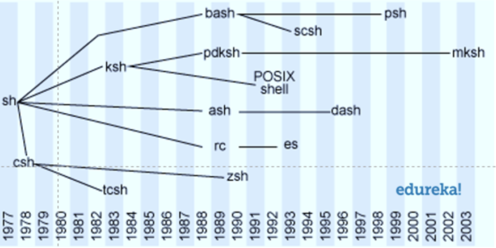

# Shell 概览

Shell 本身是一个用 C 语言编写的程序，它是用户使用 Unix/Linux 的桥梁。

Shell 既是一种命令语言，又是一种程序设计语言。作为命令语言，它会接收用户输入的各种命令，并传递给操作系统执行；作为程序设计语言，它定义了各种变量和参数，并提供了许多在高级语言中才具有的控制结构，包括循环和分支。

## Shell 的种类

Shell 是一种脚本语言，必须由解释器来执行这些脚本。Unix/Linux 上常见的 Shell 脚本解释器有：bash、sh、csh、ksh 等，我们常说的有多少种 Shell，其实就是说的是 Shell 脚本解释器。

- bash：Linux 标准默认的 shell,是 BourneAgain Shell 的缩写，内部命令一共 40 个。
- sh：Unix 标准默认的 shell，是 Bourne Shell 的缩写，由 Steve Bourne 开发。
- ash：Linux 中占用系统资源最少的一个 shell，只包含 24 个内部命令，因此使用起来很不方便。
- csh：Linux 比较大的 shell，由 47 位作者编成，共有 52 个内部命令。该 shell 其实是指向 /bin/tcsh，也就是说，csh 其实就是 tcsh。
- ksh：是 Korn Shell 的缩写，共有 42 条内部命令。
- zsh: 设计用于交互的强大 shell 与脚本语言
- fish: 智能且友好的命令行 shell

**注意：bash 基于 sh，并吸收了 csh 和 ksh 的一些特性。bash 完全兼容 sh，也就是说，用 sh 写的脚本可以直接在 bash 中执行，不需要任何修改。**

### Shell 脚本解释器的发展史



### 查看 Shell 程序信息

一般发行版的 Linux 系统中，标准默认的 shell 就是 bash。不过应该有很多同学会设置 zsh 为默认的 shell，因为在开源框架 [Oh My Zsh](https://ohmyz.sh/) 的加持下，如有神助。

安装完 zsh 后，永久修改当前的默认 Shell 为 zsh ：`chsh -s /bin/zsh`

查看当前系统安装的 Shell 程序： `cat /etc/shells`（以下所有代码中，\$ 开头的命令，其他的是输出）

```
$ cat /etc/shells

/bin/sh
/bin/bash
/sbin/nologin
/usr/bin/sh
/usr/bin/bash
/usr/sbin/nologin
/bin/tcsh
/bin/csh
/bin/zsh
```

查看 Shell 程序的安装全路径

```
$ type -a bash
bash is /bin/bash
```

查看当前的 Shell 程序： `echo $SHELL` 或 `echo $0` 或 `ps $$`

```
$ echo $SHELL

/bin/zsh
```

切换当前的 Shell 程序为 bash ： `bash` 退出用 `exit`

```
$ bash

$ echo $SHELL

/bin/bash

$ exit

$ echo $SHELL

/bin/zsh
```

## 参考文档

[Shell 中傻傻分不清楚的 TOP3](https://mp.weixin.qq.com/s/UofKYTb9hp2FXYIKM5Q3Qw)
